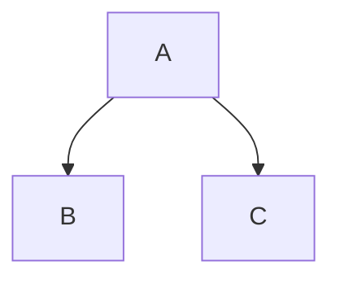
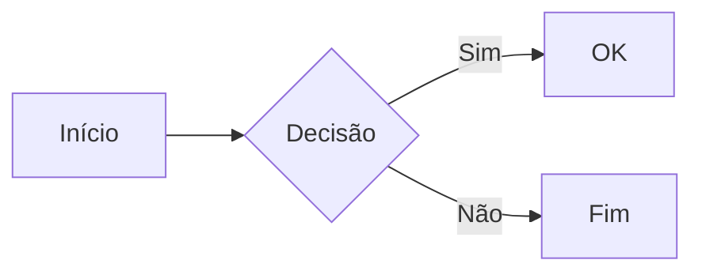
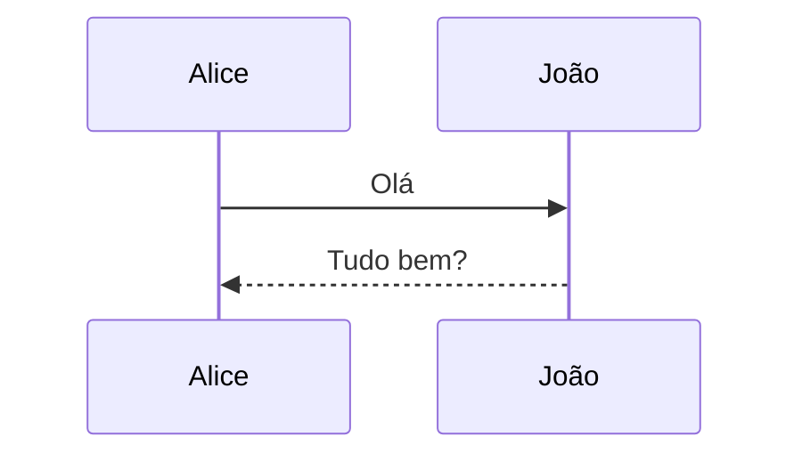
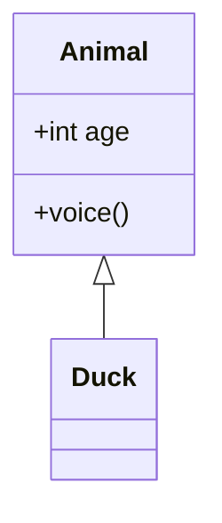
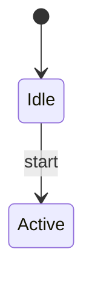
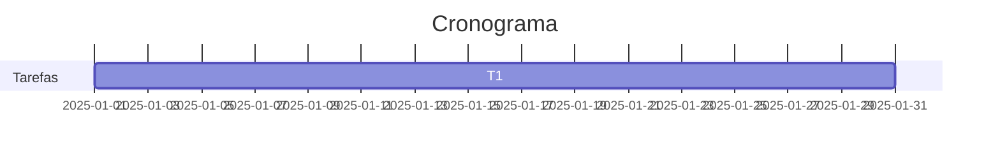
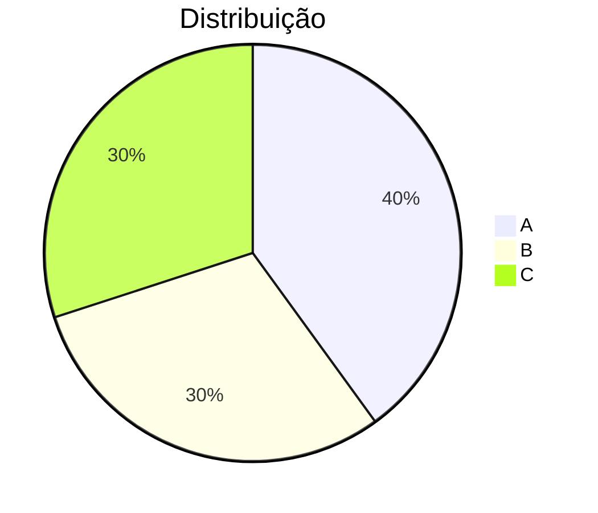
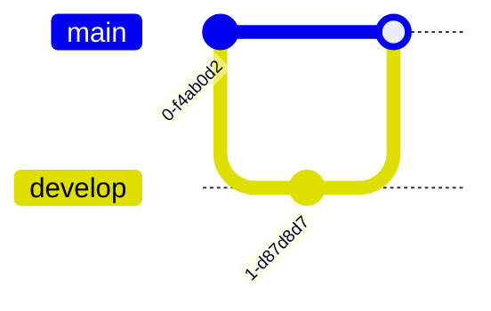
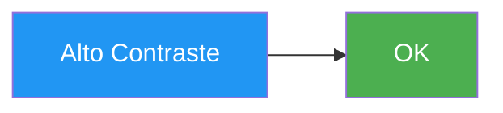

# MARCAÇÃO — Formatação, Documentação e Segurança

## 1. Markdown Avançado

### Tabelas Complexas

Alinhamento de colunas com `:` na linha de separação:

```markdown
| Esquerda | Centralizado | Direita |
|:---------|:------------:|--------:|
| valor    |   valor      |   valor |
```

Colspan não existe nativamente em Markdown. Workaround com HTML:

```markdown
<table>
  <tr><td colspan="2"> célula mesclada </td></tr>
  <tr><td>A</td><td>B</td></tr>
</table>
```

Múltiplas linhas dentro de uma célula: use `<br>`.

### Footnotes

```markdown
Texto com nota[^1] e outra[^2].

[^1]: Primeira nota explicativa.
[^2]: Segunda nota, com mais detalhes.
```

### Task Lists

```markdown
- [x] Tarefa concluída
- [ ] Tarefa pendente
- [~] Tarefa em andamento (GitLab)
```

### Definition Lists

```markdown
Termo
: Definição do termo, pode ter múltiplas linhas.
: Segunda definição para o mesmo termo.
```

### Strikethrough, Highlight, Sub/Superscript

```markdown
~~texto riscado~~  
==texto destacado== (markdownlint pode reclamar)  
H~2~O (subscrito)  
X^2^ (sobrescrito, GFM)
```

### Details/Summary (Collapsible)

```markdown
<details>
<summary>Clique para expandir</summary>

Conteúdo oculto até o clique.  
Pode conter **Markdown** normalmente.
</details>
```

### Emoji Shortcodes

```markdown
:rocket: :warning: :white_check_mark: :x: :book:
```

### Automatic URL Linking

```markdown
<https://exemplo.com> → link clicável  
URLs simples como https://exemplo.com viram link automaticamente no GFM.
```

### Heading IDs e Cross-references

```markdown
## Minha Seção {#minha-secao}

Veja [Minha Seção](#minha-secao) acima.
```

No GFM, headings geram ID automático (slug). Use `#minha-secao` diretamente.

### Escaping Special Characters

Use `\` antes de caracteres especiais: `\*`, `\#`, `\_`, `\[`, `\`, `` \` ``.

### Code Blocks Avançados

Diff:
```diff
- linha removida
+ linha adicionada
```

Mermaid:


Math (LaTeX):
```math
E = mc^2
```

## 2. Diagramas como Código

### Mermaid

**Flowchart:**


**Sequence:**


**Class:**


**State:**


**Gantt:**


**Pie:**


**Gitgraph:**


### PlantUML

PlantUML não é suportado nativamente no GFM. Use imagens embed ou extensões:

```markdown

```

### ASCII Diagrams

Úteis em documentação sem renderizador:

```
+---------+     +---------+
| Client  |---->| Server  |
+---------+     +---------+
```

## 3. Documentação

### Estrutura de README

1. **Badges** — status do build, cobertura, licença, versão
2. **Instalação** — pré-requisitos e comandos
3. **Uso** — exemplos rápidos
4. **API** — documentação de endpoints/funções
5. **Contribuindo** — guia de contribuição
6. **Licença** — tipo de licença

```markdown
# Nome do Projeto


## Instalação

```bash
npm install meu-pacote
```

## Uso

```javascript
import { algo } from 'meu-pacote';
algo();
```
```

### API Documentation (OpenAPI)

Integre OpenAPI/Swagger usando `oas` em blocos de código ou referencie arquivos YAML:

```yaml
openapi: 3.0.0
info:
  title: Minha API
  version: 1.0.0
paths:
  /users:
    get:
      summary: Lista usuários
      responses:
        '200':
          description: OK
```

Ou use plugins que renderizam inline (ex: `@redocly/plugin`).

### Multi-language Documentation

Estrutura de pastas para docs multi-idioma:

```
docs/
  pt-BR/
    README.md
  en/
    README.md
  ja/
    README.md
```

Ou use o `README.md` principal como índice:

```markdown
Idiomas disponíveis: [🇧🇷 Português](docs/pt-BR/) · [🇺🇸 English](docs/en/) · [🇯🇵 日本語](docs/ja/)
```

### Versioning Documentation

Pasta por versão (ex: `docs/v1.0/`, `docs/v2.0/`) ou tags no repo. Use `docusaurus`/`vitepress` para versionamento automático.

### Changelog (Keep a Changelog)

```markdown
# Changelog

## [1.1.0] - 2025-06-14

### Added
- Nova funcionalidade X

### Fixed
- Bug no módulo Y

## [1.0.0] - 2025-01-01

### Added
- Release inicial
```

Siga [keepachangelog.com](https://keepachangelog.com). Versões seguem [SemVer](https://semver.org).

### Decision Records (ADRs)

Nome do arquivo: `adr-001-titulo-curto.md`

```markdown
# ADR 001: Uso do Framework X

## Contexto
Precisamos de um framework para o frontend.

## Decisão
Optamos pelo Framework X por sua performance e ecossistema.

## Consequências
Equipe precisa de treinamento. Benefícios em produtividade.
```

### Runbook Structure

```markdown
# Runbook: Serviço Y

## Descrição
Serviço responsável por processar filas.

## Health Check
`GET /health` — espera 200 OK.

## Alertas
- P95 > 500ms → alertar time
- Erro 5xx > 1% → páginação automática

## Procedimentos
1. Acessar dashboard: `kubectl get pods`
2. Coletar logs: `kubectl logs <pod>`
3. Reiniciar: `kubectl rollout restart deployment/y`
```

## 4. Acessibilidade em Documentação

### Alt Text em Imagens

```markdown

```

Nunca use imagens decorativas sem alt. Se for decorativa, use `alt=""`.

### Table Headers e Captions

```markdown
<caption>Tabela 1: Resultados da pesquisa</caption>

| Nome  | Idade |
|-------|-------|
| Ana   | 30    |
| Bruno | 25    |
```

Table headers sempre use `---` na segunda linha (sem isso, não é tabela).

### Link Text Best Practices

Ruim: `clique aqui` ou `veja mais`.  
Bom: `veja o guia de contribuição` ou `leia a documentação da API`.

```markdown
- ✅ [Documentação da API REST](/api)
- ❌ [Clique aqui](/api)
```

### Color Contrast

Em diagramas Mermaid, evite cores claras em fundo claro ou escuras em fundo escuro. Prefira paletas de alto contraste:



### Screen Reader Friendly Structure

- Use headings hierárquicos sem pular níveis (`#` → `##` → `###`, nunca `#` → `###`).
- Listas para grupos de itens relacionados.
- Tabelas com dados tabulares reais; não use tabelas para layout.
- Links com texto descritivo (nunca URLs cruas).

## 5. Segurança em Markdown

### XSS Prevention

Editores de Markdown normalmente sanitizam HTML. Se seu renderizador aceita HTML:

- Bloqueie `<script>`, `onerror`, `onclick`, `javascript:`.
- Sanitize com DOMPurify ou `rehype-sanitize` se estiver no ecossistema Remark.

```markdown
<script>alert('XSS')</script>  <!-- BLOQUEADO por sanitizadores -->
  <!-- BLOQUEADO -->
```

### No Secret Leakage

Nunca coloque tokens, senhas, API keys ou chaves privadas em arquivos Markdown:

```markdown
❌ GH_TOKEN=ghp_xxxxxxxxxxxx
❌ aws_access_key_id=AKIAxxxxxx
✅ Use variáveis de ambiente: `process.env.API_KEY`
```

Adicione `.md` ao `.gitignore` de secrets ou use `git-secrets` para prevenir leaks.

### Safe HTML Tag Whitelisting

Tags seguras: `<details>`, `<summary>`, `<table>`, `<tr>`, `<td>`, `<th>`, `<caption>`, `<kbd>`, `<sup>`, `<sub>`. Tags perigosas: `<script>`, `<iframe>`, `<object>`, `<embed>`, `<style>` (com CUIDADO), `<form>`, `<input>`.

Configure a whitelist do seu renderizador para aceitar só o necessário.

### CSP Considerations

Se o Markdown é renderizado numa página web com CSP:

```
Content-Security-Policy: default-src 'self'; script-src 'none'; img-src 'self' https:;
```

Isso bloqueia inline scripts e imagens externas — importante para segurança.

### Link Safety

Nunca use `javascript:` em links:

```markdown
❌ [clique](javascript:alert(1))
✅ [link seguro](https://exemplo.com)
```

Configure validação no linter: `markdownlint rule MD034` (bare URLs) e extensão customizada para proibir protocolos perigosos.

### Link Spoofing

Verifique se o texto do link corresponde ao destino real:

```
Aparência: https://google.com
Real:      https://malicioso.com/steal
```

Use `markdownlint` com regras de link verification. Em reviews humanos, confira destinos.

## 6. Markdown no Ecossistema

### GitHub Flavored Markdown (GFM)

GFM adiciona ao CommonMark:
- Tabelas com pipes
- Task lists `- [x]`
- Strikethrough `~~`
- URLs automáticas
- Emoji shortcodes `:rocket:`
- Mencionar usuários `@usuario`
- Referenciar issues `#123`
- Blocos de código com syntax highlighting

### GitLab Flavored Markdown

Adicionais do GitLab:
- Mermaid nativo
- Math com `$` e `$$`
- `[TOC]` para sumário automático
- Task lists com estado `[~]` (em andamento)
- Video embeds com ``

### MDX (JSX em Markdown)

MDX permite JSX dentro de Markdown. Usado com Next.js, Docusaurus, Storybook.

```mdx
import { Chart } from './components/Chart'

# Título

<Chart data={dados} />

Parágrafo normal com **Markdown**.
```

Requer parser MDX (ex: `@mdx-js/mdx`, `next/mdx`).

### Remark/Rehype Ecosystem

Pipelines de transformação:

```
Markdown → remark (AST) → plugins → rehype (HAST) → HTML
```

**Plugins úteis:**
- `remark-validate-links` — valida links internos
- `remark-lint` — linter
- `remark-gfm` — suporte GFM
- `remark-math` + `rehype-katex` — renderização de math
- `rehype-sanitize` — segurança HTML
- `rehype-prism` / `rehype-highlight` — syntax highlighting

Exemplo de pipeline (Node.js):

```javascript
import { unified } from 'unified'
import remarkParse from 'remark-parse'
import remarkGfm from 'remark-gfm'
import remarkRehype from 'remark-rehype'
import rehypeStringify from 'rehype-stringify'

const file = await unified()
  .use(remarkParse)
  .use(remarkGfm)
  .use(remarkRehype)
  .use(rehypeStringify)
  .process('# Hello *world*')
```

### Markdown Linting (markdownlint)

Regras essenciais (`markdownlint`):

| Regra | Descrição |
|:------|:----------|
| MD001 | Headings incrementais (sem pular nível) |
| MD009 | Sem trailing spaces |
| MD012 | Múltiplas linhas em branco consecutivas |
| MD013 | Comprimento de linha (opcional, configurável) |
| MD022 | Linhas em branco ao redor de headings |
| MD024 | Headings duplicados |
| MD026 | Sem pontuação em headings |
| MD029 | Listas ordenadas com prefixo `1.` |
| MD032 | Linhas em branco ao redor de listas |
| MD034 | URLs "bare" usam `<url>` |
| MD041 | Primeira linha é um heading de nível 1 |

Configure no `.markdownlint.json`:

```json
{
  "MD013": { "line_length": 120 },
  "MD024": false,
  "MD033": { "allowed_elements": ["details", "summary", "kbd"] }
}
```

Comando via CLI:

```bash
markdownlint docs/
```

Ou integrado ao CI com GitHub Actions (`github/super-linter`, `DavidAnson/markdownlint-cli2-action`).
